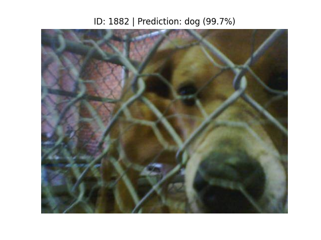
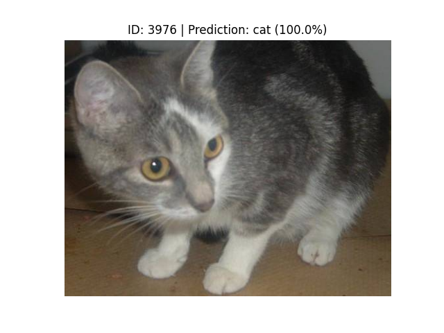
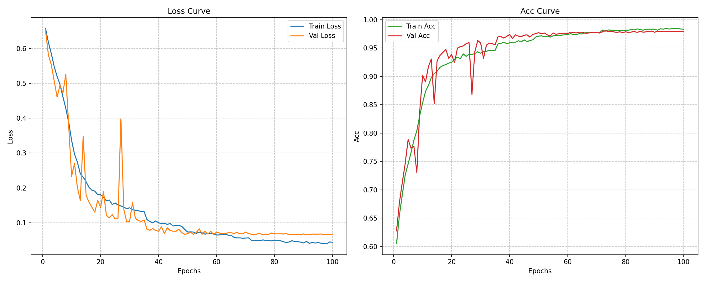

# Dogs vs. Cats

This is a PyTorch implementation of the classic Kaggle competition **"Dogs vs. Cats"** based on CNN. It achieves approximately 97% accuracy on the validation set.  
I'm using `PyTorch 2.10.0+cu128` in `Python 3.12.0`.

<br>
<p align="center">
  
</p>

## Structure
```
├── Dogs-vs-Cats/
├── data/
|   ├── raw/
|   |   ├── train
|   |   └── test
|   ├── processed/
|   |   ├── train
|   |   ├── val
|   |   └── test
├── models/
|   ├── best_model.pth
|   ├── latest_checkpoint.pth
|   ├── history.pkl
|   └── ...
├── config.py
├── utils.py
├── prepare_data.py
├── dataset.py
├── model.py
├── train.py
└── predict.py
```

## Dataset
The dataset comes from Kaggle website: [Dogs vs. Cats](https://www.kaggle.com/competitions/dogs-vs-cats-redux-kernels-edition/data).  
The training set has 25,000 images, half of which are cats and half are dogs. The test set has 12,500 images, which are not labeled as cats or dogs.

## Data Preparation & Augmentation
#### <em>Splitting</em>:  
To split the data, run the command -
```
python prepare_data.py
```
This will split the raw training data into 80% Training and 20% Validation.
#### <em>Augmentation</em>:  
I place data argumentation in ```dataset.py```
```
data_transforms = {
    'train': transforms.Compose([
        transforms.RandomResizedCrop(IMG_SIZE),
        transforms.RandomHorizontalFlip(p=0.5),
        transforms.ToTensor(),
        transforms.Normalize(mean=[0.485, 0.456, 0.406], std=[0.229, 0.224, 0.225])
    ]),

    'val': transforms.Compose([
        transforms.Resize(256),
        transforms.CenterCrop(IMG_SIZE),
        transforms.ToTensor(),
        transforms.Normalize(mean=[0.485, 0.456, 0.406], std=[0.229, 0.224, 0.225])
    ])
}
```
It converts images into tensors that model can accept, and improves model's generalization ability by augmenting the training set.

## Train
To start training, run the command - 
```
python train.py
```
I use ```ReduceLROnPlateau``` to monitor the validation loss. If the validation loss does not decrease within 5 epochs, the learning rate is reduced by a factor of 0.5.
```
scheduler = ReduceLROnPlateau(
    optimizer,
    mode='min',
    factor=0.5,
    patience=5,
)
```
The file saves the latest model after each epoch as ```latest_checkpoint.pth``` to support resuming training after an interruption. Additionally, it saves the best model based on the validation loss as ```best_model.pth```. Furthermore, the file saves a checkpoint every 10 epochs.

## Test
To test your trained model, run the command -
```
python predict.py
```
It randomly selects an image from the test set, and displays the image and the model's predicition results.

<br>
<p align="center">
  
  
</p>

You can use my pretrained model to play: [best_model.pth](https://drive.google.com/uc?export=download&id=1je-Ft9CuVakb-sllV_hnVMicP1lbvw8S)

## Loss Curve
As the picture says, the model can achieve approximately 97% accuracy on the validation set after training for 100 epochs. 🐶🐱

<br>
<p align="center">
  
</p>
